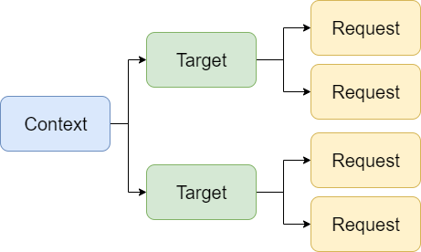

# Docs

Solution to create a domain-oriented documentation from source code.
Sample usage in [Atles](https://github.com/lucabriguglia/Atles).

## Installation

Install the package in your project(s) via .NET CLI
```
dotnet add package LucaBriguglia.Docs
```

## Configuration

Register the package in the ConfigureServices method of Startup.cs:

```C#
services.AddDocs();
```

## Usage

The hierarchy of the genearted documentation will be similar to the one shown in the following diagram:



There are two attributes that can be used to decorate your classes: **DocTarget** and **DocRequest**.
The name of the context can be provided as parameter in the DocTarget atrbiute as shown below:

```C#
/// <summary>
/// Description of SampleTarget.
/// </summary>
[DocTarget("Sample Context")]
public class SampleTarget
{
    /// <summary>
    /// Description of Name.
    /// </summary>
    public string Name { get; set; }
}
```

If no context is provided the target will automatically be assigned to the default context called _General_.
When using the DocRequest attrrbiute it is required to provide the type of the related target as done for this sample request:

```C#
/// <summary>
/// Description of SampleRequest.
/// </summary>
[DocRequest(typeof(SampleTarget))]
public class SampleRequest
{
    /// <summary>
    /// Description of Name.
    /// </summary>
    public string Name { get; set; }
}
```

Target and request classes do not need to be in the same project, they can be in different assemblies even if part of the same context.
In order to generate and get the documentation, you need to use the IDocumentationService interface.
The IDocumentationService interface has three methods:

```C#
public interface IDocumentationService
{
    void Generate(params Assembly[] assemblies);
    string GetLatestAsJson();
    DocumentationModel GetLatest();
}
```

- **Generate** will scan the assemblies provided and save a single JSON file with the whole documentation in the default location 
which is `Documentation/documentation.v1.json` where `v1` is the sequential verison number in case of multiple generations. 
The projects that need to be included are required to generate the XML documentation file which contains the comments.
- **GetLatestAsJson** will return the content of the latest version of the documentation as a json string.
- **GetLatest** will return a DocumentationModel object by automatically deserializing the content of the latest version of the documentation.

If SampleTarget and SampleRequest are in the same assembly, you have to provide only one assembly as follows:

```C#
documentationService.Generate(typeof(SampleTarget).Assembly);
```

Instead, if SampleTarget and SampleRequest are in different assemblies, you need to provide both:

```C#
documentationService.Generate(typeof(SampleTarget).Assembly, typeof(SampleRequest).Assembly);
```

Once the docuemntation is generated, you can retrieve it by either getting the JSON string:

```C#
var json = documentationService.GetLatestAsJson();
```

or the DocumentationModel obejct:

```C#
var model = documentationService.GetLatest();
```

An example of how to use the model to display the documentation is given in the [Atles Domain Docs Page](https://github.com/lucabriguglia/Atles/blob/master/src/Atles.Client/Pages/Docs.razor).
